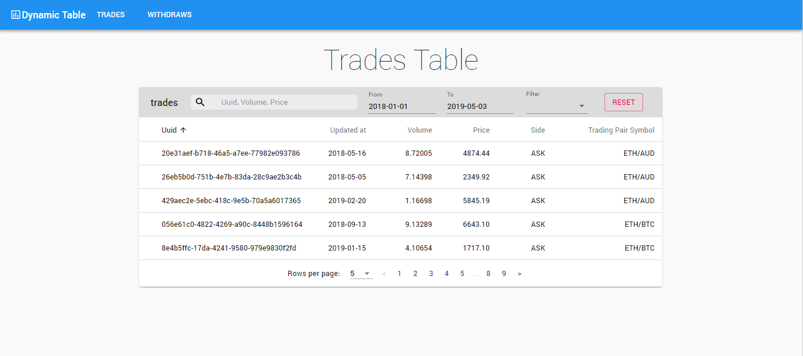

# Dynamic Table

[![NPM Version][npm-image]][npm-url]
[![Build Status][travis-image]][travis-url]

One to two paragraph statement about your product and what it does.



## Installation

NPM:

```sh
npm install
```

Download and install the dynamic-server from <https://github.com/BubbleKID/dynamic-table-server>
or you can modify the string

```sh
serverUrl
```

at src/api/server.jsx to

```sh
https://dynamic-table-server.herokuapp.com
```

## Scripts

### Start

```sh
npm start
```

### Test

```sh
npm test
```

### Build

```sh
npm run build
```

## Dependencies

* [Material-ui](https://material-ui.com/) - The UI framework used
* [React](https://reactjs.org/) - The web framework used
* [react-router-dom](https://reacttraining.com/react-router/web/guides/quick-start/) - Used to generate routes
* [material-ui-flat-pagination](https://www.npmjs.com/package/material-ui-flat-pagination/) - Used to generate pagination
* [material-ui-pickers](https://material-ui-pickers.dev/) - Used to date pickers
* [axios](https://www.npmjs.com/package/axios/) - Used to send http request
